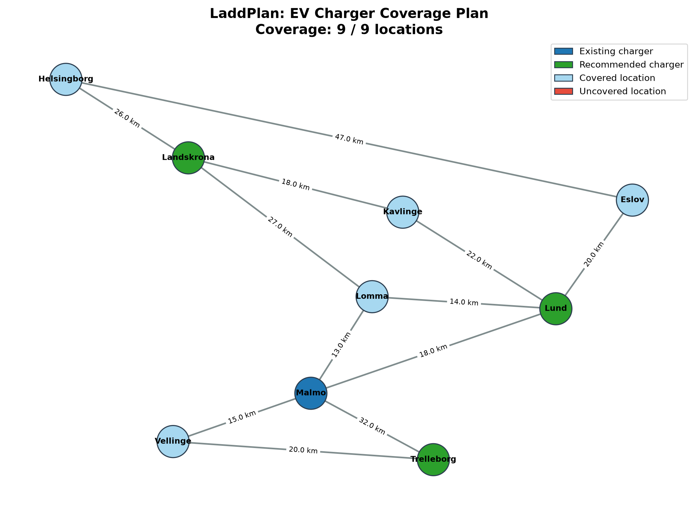
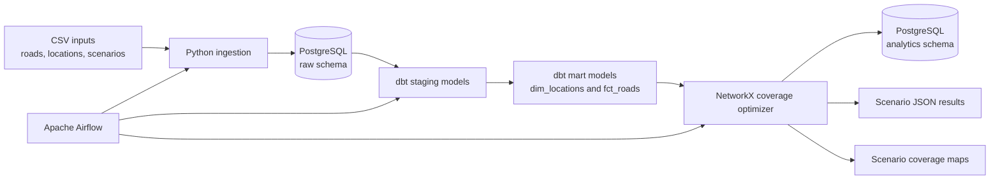

# LaddPlan

LaddPlan is an end-to-end data engineering project that recommends EV charger locations using a weighted road-network coverage model.

The project ingests location and road data into PostgreSQL, validates it with dbt, orchestrates the workflow with Apache Airflow, and uses NetworkX to recommend charger locations that maximise coverage within a configurable driving-distance limit.



## Architecture



## Pipeline

```text
CSV files
  → Python ingestion
  → PostgreSQL raw tables
  → dbt staging and mart models
  → dbt data-quality tests
  → NetworkX charger-coverage optimisation
  → PostgreSQL recommendation history
  → JSON results and PNG coverage maps
```

Apache Airflow orchestrates the pipeline in this order:

```text
load_csv_data → build_dbt_models → run_coverage_optimizer
```

## Optimisation approach

1. Locations are represented as nodes in a NetworkX graph.
2. Roads are weighted edges, where each weight represents driving distance in kilometres.
3. Dijkstra's algorithm calculates the shortest road distance from every location to its nearest charger.
4. A location is considered covered when its nearest charger is within the configured coverage limit.
5. A greedy algorithm evaluates available candidate locations and selects the charger that provides the greatest additional coverage.
6. The process repeats until the new-charger budget is used.

## Scenarios

LaddPlan supports multiple input scenarios through JSON configuration files stored in `data/scenarios/`.

| Scenario | Existing chargers | Coverage limit | New-charger budget | Purpose |
|---|---|---:|---:|---|
| `baseline` | Malmö | 30 km | 3 | Standard demonstration scenario |
| `limited_budget` | Malmö | 30 km | 2 | Tests a constrained expansion budget |
| `short_range` | Malmö | 20 km | 3 | Tests a stricter driving-distance requirement |
| `strong_existing_network` | Malmö, Helsingborg | 30 km | 2 | Tests expansion with an existing northern charger |
| `expansion_case` | Malmö | 40 km | 1 | Tests a lower-cost, wider-coverage strategy |

Run an individual scenario with:

```powershell
python charger_coverage.py --config data\scenarios\baseline.json
```

## Scenario outputs

Each scenario produces separate output files, so results are not overwritten.

| Scenario | Coverage map | Recommendation output |
|---|---|---|
| Baseline | [baseline_coverage.png](output/baseline_coverage.png) | [baseline_recommendations.json](output/baseline_recommendations.json) |
| Limited budget | [limited_budget_coverage.png](output/limited_budget_coverage.png) | [limited_budget_recommendations.json](output/limited_budget_recommendations.json) |
| Short range | [short_range_coverage.png](output/short_range_coverage.png) | [short_range_recommendations.json](output/short_range_recommendations.json) |
| Strong existing network | [strong_existing_network_coverage.png](output/strong_existing_network_coverage.png) | [strong_existing_network_recommendations.json](output/strong_existing_network_recommendations.json) |
| Expansion case | [expansion_case_coverage.png](output/expansion_case_coverage.png) | [expansion_case_recommendations.json](output/expansion_case_recommendations.json) |

Generate a combined CSV comparison after running all scenarios:

```powershell
python src\create_scenario_summary.py
```

This creates:

```text
output/scenario_summary.csv
```

## Baseline result

| Setting | Value |
|---|---|
| Existing charger | Malmö |
| Coverage limit | 30 km |
| New-charger budget | 3 |
| Recommended locations | Landskrona, Lund, Trelleborg |
| Final coverage | 9 of 9 locations |

## Data model

### Raw schema

| Table | Purpose |
|---|---|
| `raw.locations` | Source locations and map coordinates |
| `raw.roads` | Road-network connections and distances |

### Analytics schema

| Object | Purpose |
|---|---|
| `analytics.stg_locations` | Cleaned locations staging view |
| `analytics.stg_roads` | Cleaned roads staging view |
| `analytics.dim_locations` | Validated location dimension used by the optimiser |
| `analytics.fct_roads` | Validated weighted road-network view used by the optimiser |
| `analytics.recommendation_runs` | Historical optimisation runs |
| `analytics.recommended_chargers` | Recommended chargers per run and selection order |

## Data quality

dbt validates the road network before the optimiser runs.

Current automated tests include:

- Unique and non-null location IDs and names
- Unique and non-null road IDs
- Non-null road start locations, end locations, and distances
- Referential integrity checks ensuring every road endpoint exists in `dim_locations`

The project currently includes 26 dbt data-quality tests.

## Tech stack

| Area | Tools |
|---|---|
| Language | Python |
| Graph algorithm | NetworkX |
| Database | PostgreSQL 16 |
| Transformations and testing | dbt Core and dbt-postgres |
| Orchestration | Apache Airflow |
| Containerisation | Docker Compose |
| Visualisation | Matplotlib |
| Database driver | Psycopg |

## Project structure

```text
LaddPlan/
├── airflow/
│   └── dags/
│       └── laddplan_pipeline.py
├── data/
│   ├── locations.csv
│   ├── roads.csv
│   └── scenarios/
│       ├── baseline.json
│       ├── expansion_case.json
│       ├── limited_budget.json
│       ├── short_range.json
│       └── strong_existing_network.json
├── dbt/
│   └── laddplan/
│       ├── dbt_project.yml
│       └── models/
│           ├── staging/
│           └── marts/
├── output/
│   ├── baseline_coverage.png
│   ├── baseline_recommendations.json
│   ├── expansion_case_coverage.png
│   ├── expansion_case_recommendations.json
│   ├── limited_budget_coverage.png
│   ├── limited_budget_recommendations.json
│   ├── scenario_summary.csv
│   ├── short_range_coverage.png
│   ├── short_range_recommendations.json
│   ├── strong_existing_network_coverage.png
│   └── strong_existing_network_recommendations.json
├── sql/
│   └── init.sql
├── src/
│   ├── create_scenario_summary.py
│   └── ingestion/
│       └── load_csv_to_postgres.py
├── charger_coverage.py
├── config.json
├── docker-compose.yml
├── Dockerfile.airflow
├── requirements.txt
└── requirements-airflow.txt
```

## Run locally

### Prerequisites

- Docker Desktop
- Python 3.12 or later
- PowerShell

### 1. Clone the repository

```powershell
git clone https://github.com/YOUR-GITHUB-USERNAME/LaddPlan.git
cd LaddPlan
```

### 2. Create a virtual environment

```powershell
python -m venv .venv
.\.venv\Scripts\Activate.ps1
```

### 3. Install dependencies

```powershell
pip install -r requirements.txt
```

### 4. Start PostgreSQL

```powershell
docker compose up -d postgres
```

### 5. Load source data

```powershell
python src\ingestion\load_csv_to_postgres.py
```

### 6. Run dbt transformations and tests

```powershell
dbt build --project-dir .\dbt\laddplan --profiles-dir .\dbt\laddplan
```

### 7. Run a scenario

```powershell
python charger_coverage.py --config data\scenarios\baseline.json
```

## Run with Airflow

### Initialise Airflow

```powershell
docker compose build
docker compose up airflow-init
```

### Start the Airflow services

```powershell
docker compose up -d airflow-webserver airflow-scheduler
```

Open the Airflow UI:

```text
http://localhost:8080
```

Local development credentials:

```text
Username: admin
Password: admin
```

Trigger the `laddplan_pipeline` DAG from the Airflow UI.

The DAG runs:

```text
load_csv_data → build_dbt_models → run_coverage_optimizer
```

## Manual commands

Run individual pipeline components without Airflow:

```powershell
python src\ingestion\load_csv_to_postgres.py

dbt build --project-dir .\dbt\laddplan --profiles-dir .\dbt\laddplan

python charger_coverage.py --config data\scenarios\baseline.json

python src\create_scenario_summary.py
```

## Outputs

After a successful scenario run, LaddPlan produces:

- A scenario-specific coverage-map image in `output/`
- A scenario-specific machine-readable JSON recommendation file in `output/`
- Historical optimisation records in `analytics.recommendation_runs`
- Recommended charger locations in `analytics.recommended_chargers`
- A combined scenario comparison file at `output/scenario_summary.csv`

Example recommendation output:

```json
{
  "app_name": "LaddPlan",
  "coverage_limit_km": 30,
  "existing_chargers": ["Malmo"],
  "recommended_chargers": [
    "Landskrona",
    "Lund",
    "Trelleborg"
  ],
  "total_locations": 9,
  "covered_locations": 9,
  "uncovered_locations": []
}
```

## Limitations

- Road distances are manually defined for this learning project.
- Visual map coordinates are illustrative and are not real geographical coordinates.
- The greedy method provides a strong local solution but does not guarantee a mathematically optimal global solution.
- The model does not currently include installation cost, charger demand, charger speed, traffic, battery range, or live availability.

## Future improvements

- Ingest real Swedish charging-station data from the NOBIL API.
- Use real road distances and travel times from a routing service.
- Include population, traffic, and charger-demand data.
- Compare the greedy approach with an optimisation solver.
- Add an interactive Streamlit dashboard.
- Add GitHub Actions for automated tests and dbt validation.
- Add charger-outage scenarios to assess backup coverage.

## Author

Built by Yaswanth as a portfolio project demonstrating end-to-end data engineering, analytics engineering, workflow orchestration, and graph-based optimisation.