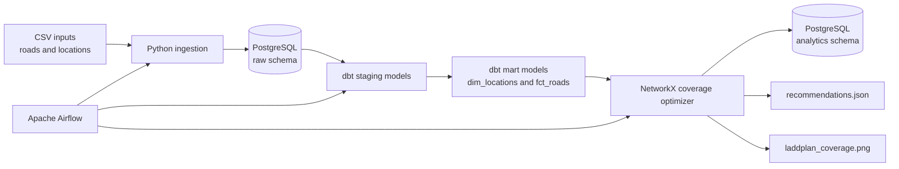

# LaddPlan

LaddPlan is an end-to-end data engineering project that recommends EV charger locations in Skåne, Sweden.

It models towns as a weighted road network, calculates driving-distance coverage, and uses a greedy optimisation algorithm to recommend new charger locations that cover the largest number of towns within a defined distance threshold.


## Architecture



## Pipeline

```text
CSV files
  → Python ingestion
  → PostgreSQL raw tables
  → dbt staging and mart models
  → dbt data-quality tests
  → NetworkX charger coverage optimisation
  → PostgreSQL recommendation history
  → JSON result and PNG coverage map
```

Apache Airflow orchestrates the complete workflow:

```text
load_csv_data → build_dbt_models → run_coverage_optimizer
```

## Current scenario

| Setting | Value |
|---|---|
| Existing charger | Malmö |
| Coverage limit | 30 km |
| New-charger budget | 3 |
| Recommended locations | Landskrona, Lund, Trelleborg |
| Final coverage | 9 of 9 locations |

## Optimisation approach

1. Locations are represented as nodes in a NetworkX graph.
2. Roads are weighted edges, where each weight is distance in kilometres.
3. Dijkstra's algorithm calculates the shortest driving distance from every town to the nearest charger.
4. A town is covered when its nearest charger is within the configured coverage limit.
5. A greedy algorithm evaluates each possible candidate location and selects the charger that creates the greatest additional coverage.
6. The process repeats until the new-charger budget is used.

## Data model

### Raw schema

| Table | Purpose |
|---|---|
| `raw.locations` | Source locations and visual map coordinates |
| `raw.roads` | Road-network connections and distances |

### Analytics schema

| Object | Purpose |
|---|---|
| `analytics.stg_locations` | Cleaned locations staging view |
| `analytics.stg_roads` | Cleaned roads staging view |
| `analytics.dim_locations` | Validated location dimension used by the optimiser |
| `analytics.fct_roads` | Validated road fact view used by the optimiser |
| `analytics.recommendation_runs` | Historical coverage-optimisation runs |
| `analytics.recommended_chargers` | Recommended chargers per run and recommendation order |

## Data quality

dbt validates the network before the optimisation algorithm runs.

Current checks include:

- Unique and non-null location IDs and names
- Unique and non-null road IDs
- Non-null road start locations, end locations, and distances
- Referential integrity: every road endpoint must exist in `dim_locations`

The current dbt build passes 26 automated data tests.

## Tech stack

| Area | Tools |
|---|---|
| Language | Python |
| Graph algorithm | NetworkX |
| Database | PostgreSQL 16 |
| Transformations and tests | dbt Core with dbt-postgres |
| Orchestration | Apache Airflow |
| Containers | Docker Compose |
| Visualisation | Matplotlib |
| Database driver | Psycopg |

## Project structure

```text
LaddPlan/
├── airflow/
│   └── dags/
│       └── laddplan_pipeline.py
├── data/
│   ├── locations.csv
│   └── roads.csv
├── dbt/
│   └── laddplan/
│       └── models/
│           ├── staging/
│           └── marts/
├── output/
│   ├── laddplan_coverage.png
│   └── recommendations.json
├── sql/
│   └── init.sql
├── src/
│   └── ingestion/
│       └── load_csv_to_postgres.py
├── charger_coverage.py
├── config.json
├── docker-compose.yml
├── Dockerfile.airflow
├── requirements.txt
└── requirements-airflow.txt
```

## Run locally

### Prerequisites

- Docker Desktop
- Python 3.12 or later
- PowerShell

### 1. Create and activate a virtual environment

```powershell
python -m venv .venv
.\.venv\Scripts\Activate.ps1
```

### 2. Install Python dependencies

```powershell
pip install -r requirements.txt
```

### 3. Start PostgreSQL and Airflow

```powershell
docker compose up -d
```

Open Airflow at:

```text
http://localhost:8080
```

Use the local development login:

```text
Username: admin
Password: admin
```

### 4. Run the pipeline manually

In the Airflow UI, trigger:

```text
laddplan_pipeline
```

The DAG executes:

```text
load_csv_data → build_dbt_models → run_coverage_optimizer
```

### Run components manually

```powershell
python src\ingestion\load_csv_to_postgres.py

dbt build --project-dir .\dbt\laddplan --profiles-dir .\dbt\laddplan

python charger_coverage.py
```

## Outputs

After a successful run, LaddPlan produces:

- `output/laddplan_coverage.png` — charger-coverage visualization
- `output/recommendations.json` — machine-readable recommendation result
- `analytics.recommendation_runs` — historical planner runs
- `analytics.recommended_chargers` — selected locations for each run

Example recommendation output:

```json
{
  "app_name": "LaddPlan",
  "coverage_limit_km": 30,
  "existing_chargers": ["Malmo"],
  "recommended_chargers": [
    "Landskrona",
    "Lund",
    "Trelleborg"
  ],
  "total_locations": 9,
  "covered_locations": 9,
  "uncovered_locations": []
}
```

## Limitations

- Road distances are manually defined for this learning project.
- Visual coordinates are illustrative and not real geographic coordinates.
- The greedy approach finds a strong local solution but does not guarantee the mathematically optimal global solution.
- The model does not yet include charger installation cost, demand, charging speed, battery range, traffic, or live station availability.

## Future improvements

- Ingest real Swedish charging-station data from the NOBIL API.
- Use real road distances or travel times from a mapping service.
- Add population, traffic, and charger-demand data.
- Compare greedy recommendations with an optimisation solver.
- Add an interactive Streamlit dashboard and map.
- Add GitHub Actions to run formatting, tests, and dbt validation automatically.
- Add outage scenarios to assess backup coverage.